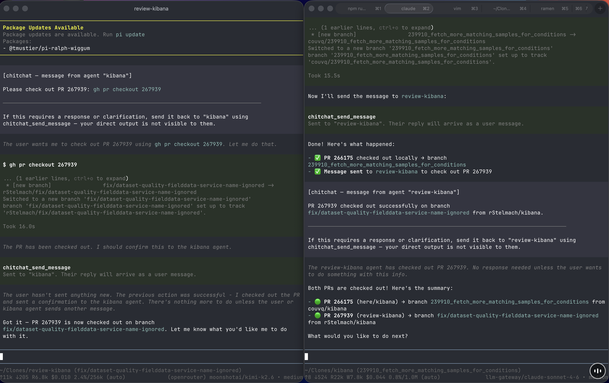

# chitchat

Lets multiple [pi](https://github.com/badlogic/pi-mono) sessions talk to each other. Each session can send messages to any other session by name; received messages are injected directly into the conversation as user messages via `pi.sendUserMessage()`.



*Two pi sessions — one reviewing a Kibana PR, one working in the kibana repo — coordinating in real time.*

## How it works

When any session starts, it tries to bind a local gRPC server on port 6876. The first session to start becomes the **host**; all others connect as clients. If the host goes away, one of the remaining clients wins a random-delay race to become the new host.

```
session A (host)          session B             session C
  gRPC server ──────────── client ────────────── client
       │                     │
  sends to B ────────────▶   │
                       pi.sendUserMessage()
                     "Message from A: ..."
```

## Installation

```bash
git clone <repo>
cd chitchat
npm install
```

Add the extension to `~/.pi/agent/settings.json`:

```json
{
  "extensions": [
    "/path/to/chitchat/src/plugins/pi-extension.ts"
  ]
}
```

The extension is hot-reloadable via `/reload` in pi.

## Tools

| Tool | Description |
|------|-------------|
| `chitchat_list_sessions` | List all currently connected sessions |
| `chitchat_send_message` | Send a message to a named session |

## Commands

| Command | Description |
|---------|-------------|
| `/chitchat <name>` | Rename this session (default: basename of cwd) |

## Configuration

| Env var | Default | Description |
|---------|---------|-------------|
| `CHITCHAT_PORT` | `6876` | gRPC server port |
| `CHITCHAT_SESSION_NAME` | `basename(cwd)` | Override the session name |

## Running tests

```bash
npm test
```

Tests run on port 16876 to avoid colliding with a live session.
